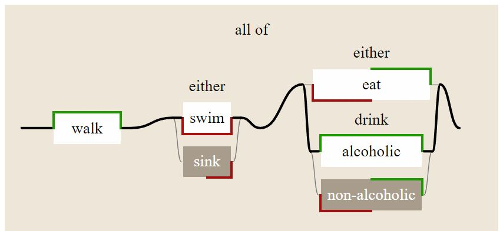

# ladder.js

Visualise boolean circuits
- composed from **combinators** *AND OR NOT*
- **labeled** with markings *known* (user-provided) and *unknown* (default)
- **values** being *TRUE FALSE UNKNOWN*

Available as:
- [Github source](https://juliapoo.github.io/ladder-diagram/index.html)
- [npm package](https://www.npmjs.com/package/ladder-diagram)

Documentation:
- [Explanation of notation](https://juliapoo.github.io/ladder-diagram/simpleTutorial.html)
- [Reference](https://juliapoo.github.io/ladder-diagram/)

For background, see:
- [Specification in Google Drive](https://drive.google.com/drive/folders/1y7TssfA925VuyuAt8VBaNxlRTo8KyqlS?usp=sharing)
- [Haskell version](https://github.com/smucclaw/dsl/tree/main/lib/haskell/anyall)
- [Purescript version](https://github.com/smucclaw/vue-pure-pdpa/tree/main/src/AnyAll)
- [Ladder Logic](https://en.wikipedia.org/wiki/Ladder_logic)
- [Shannon 1940](https://dspace.mit.edu/handle/1721.1/11173)

## Install

`npm install ladder-diagram`

## Usage

This code generates a diagram that visualises the boolean expression:


|               | `walk` | `swim` | `sink` | `eat` | `alcohol` | `non-alcohol` |
|---------------|--------|--------|--------|-------|-----------|---------------|
| Default Value | -      | F      | -      | -     | -         | F             |
| Known Value   | T      | F      | -      | F     | T         | -             |

```html
<html>
<head>
    <!-- Path to the style sheet for this codebase -->
    <link rel="stylesheet" href="./node_modules/ladder-diagram/css/ladder.css">
</head>
<body>

<!-- 
    Diagram will be generated as a child of this DOM element.
    The diagram scales with the font-size 
-->
<div id="test" style="font-size:1.5em;"></div>

<script type="module">

// Path to the main js file
import { 
    BoolVar, AllQuantifier, AnyQuantifier, LadderDiagram 
} from "./node_modules/ladder-diagram/js/ladder.js"

let circuit = new AllQuantifier([
    new BoolVar("walk", false, null, 'T'),
    new AnyQuantifier([
        new BoolVar("swim", true, 'F', 'F'),
        new BoolVar("sink", true),
    ]),
    new AnyQuantifier([
        new BoolVar("eat", false, null, 'F'),
        new AnyQuantifier([
            new BoolVar("alcoholic", false, null, 'T'),
            new BoolVar("non-alcoholic", false, 'F')
        ],
        "drink")
    ])
])

window.diagram = new LadderDiagram(
    document.getElementById("test"),
    circuit,
    "Corners" // Box styling
)
</script>
</body>
</html>
```

Given the known values of each boolean variable, the resulting expression evaluates to `True`, and the diagram highlights a "path" that explains the truth value of the expression.



## Corners vs Sides Styling

To enable an alternative box styling, change the `box_style` argument to `"Sides"`:
```js
new LadderDiagram(
    document.getElementById("test"),
    circuit,
    "Sides" // Box styling
)
``` 
This alternative design marks the sides instead of the corners, according to the original spec.


## Developing

Install dependencies:
```
npm install http-server -g
npm install jsdoc -g
```

- Testing: `npm run test`
- Building documentation: `npm run docs`

